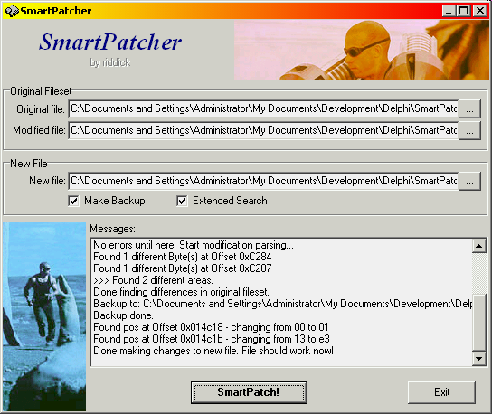

SmartPatcher
============

Finds small modifications between two files and tries to apply them to another,
similar, file.

This was used to e.g. patch newer versions of a binary, when there's no patch
for that specific version available.

